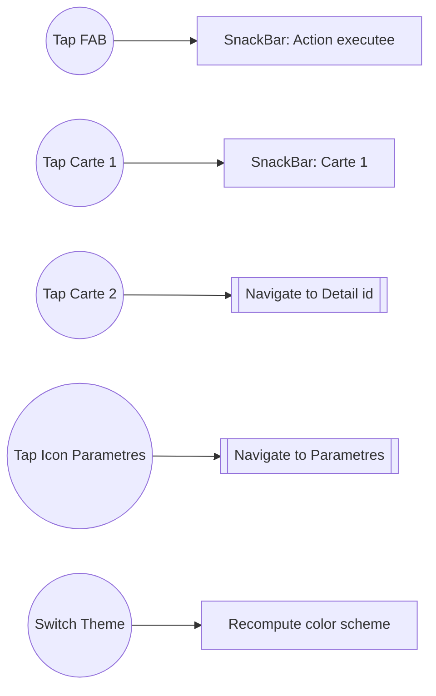
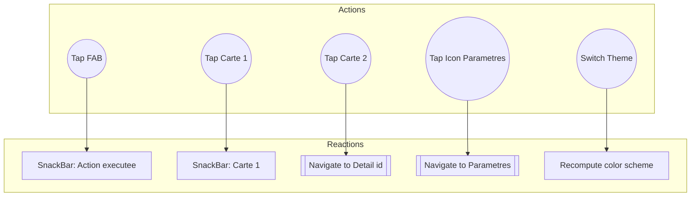
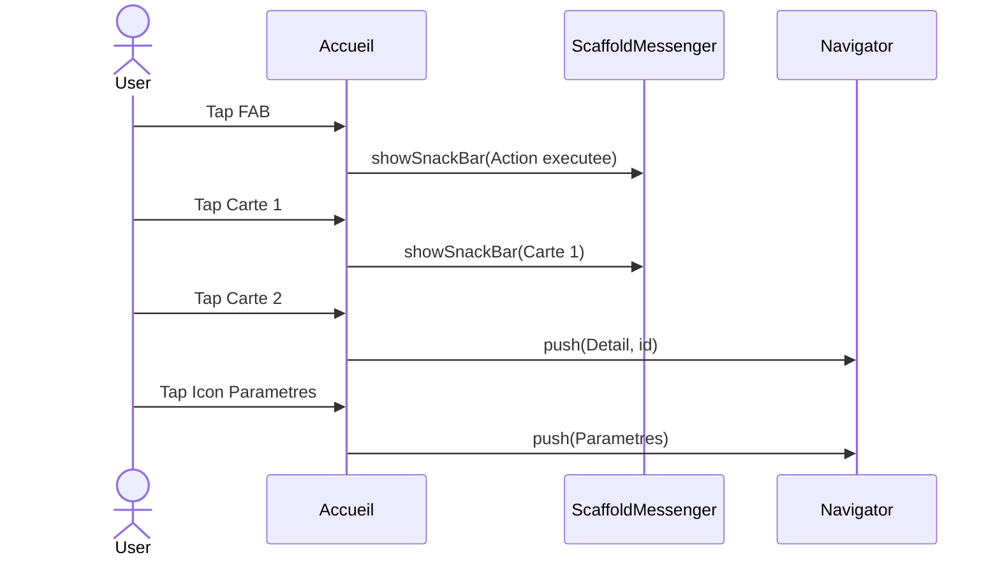

# Pratique 1


## Instructions générales


  1. **L’arborescence des widgets (Widget Tree)** pour trois écrans (Accueil, Détail, Paramètres).
  2. **La navigation entre écrans** (flux “tap” → écran).
  3. **Les interactions utilisateur → réactions UI** (par ex. “tap” → SnackBar, “tap” → Navigation).

## Contraintes

* Utilisez des noms de widgets Flutter réels (MaterialApp, Scaffold, AppBar, Body, Card, Icon…).
* Aucune notion d’état interne (Idle, Loading, etc.).


## Partie 1 – Arborescence des Widgets

**À faire :** représenter la structure hiérarchique des trois écrans. Exemple de modèle ASCII à compléter :

```
Écran Accueil
└─ MaterialApp
   └─ Scaffold
      ├─ AppBar (titre: Accueil)
      ├─ Body (SingleChildScrollView)
      │  ├─ Column
      │  │  ├─ Text("Bienvenue")
      │  │  ├─ Container (bandeau info)
      │  │  ├─ Row (3 Cartes)
      │  │  └─ Bouton décoratif
      └─ FloatingActionButton (Icon: add_alert)

Écran Détail
└─ Scaffold
   ├─ AppBar (titre dynamique)
   ├─ Body (Column)
   │  ├─ Image/Hero
   │  ├─ Text descriptif
   │  └─ Boutons d’action

Écran Paramètres
└─ Scaffold
   ├─ AppBar ("Paramètres")
   └─ Body (ListView)
      ├─ Switch Thème
      └─ Radio Langue
```


## Partie 2 – Navigation entre écrans 

**À faire :** représenter les flux “tap” → écran. Exemple :

```
Accueil --(tap Carte 2)--> Détail
Accueil --(tap Icon Paramètres)--> Paramètres
Détail --(AppBar Back)--> Accueil
Paramètres --(AppBar Back)--> Accueil
```


## Partie 3 – Interactions utilisateur → Réactions UI 

**À faire :** lister au moins 4 interactions différentes. Exemple :

```
Tap FAB            -> SnackBar: "Action exécutée"
Tap Carte 1        -> SnackBar: "Carte 1"
Tap Carte 2        -> Navigation vers Détail(id)
Tap Icon Paramètres-> Navigation vers Paramètres
Switch Thème       -> Recalcul des couleurs (UI)
```


<br/>
<br/>

# Pratique 1

## Partie 1 – Arborescence des Widgets (Mermaid)


## Partie 2 – Navigation entre écrans (Mermaid)


## Partie 3 – Interactions utilisateur → Réactions UI (Mermaid)

```mermaid
flowchart LR
  TapFAB((Tap FAB)) --> SnackFAB[SnackBar: Action executee]
  TapCarte1((Tap Carte 1)) --> SnackC1[SnackBar: Carte 1]
  TapCarte2((Tap Carte 2)) --> GoDetail[Navigate to Detail(id)]
  TapIconParams((Tap Icon Parametres)) --> GoSettings[Navigate to Parametres]
  ToggleTheme((Switch Theme)) --> Recompute[Recompute color scheme]
```


# Partie 3 — Interactions UI (Mermaid, corrigé)


## Version A — Flowchart  

```mermaid
flowchart LR
  TapFAB((Tap FAB)) --> SnackFAB[SnackBar: Action executee]
  TapCarte1((Tap Carte 1)) --> SnackC1[SnackBar: Carte 1]
  TapCarte2((Tap Carte 2)) --> GoDetail[Navigate to Detail (id)]
  TapIconParams((Tap Icon Parametres)) --> GoSettings[Navigate to Parametres]
  ToggleTheme((Switch Theme)) --> Recompute[Recompute color scheme]
```


## Version B — Flowchart avec déclaration des nœuds puis liens




## Version C — Flowchart avec sous-graphes 




## Version D — Sequence Diagram 




## Version E — interaction 


