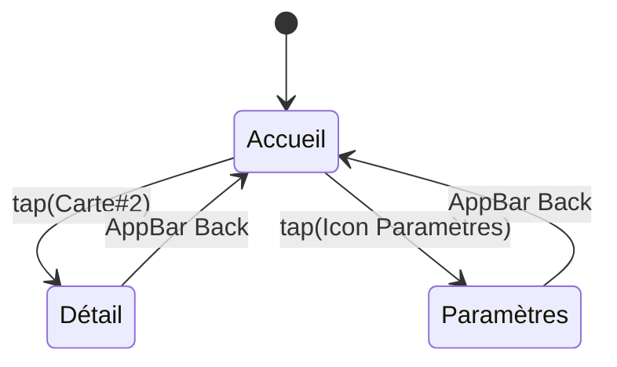
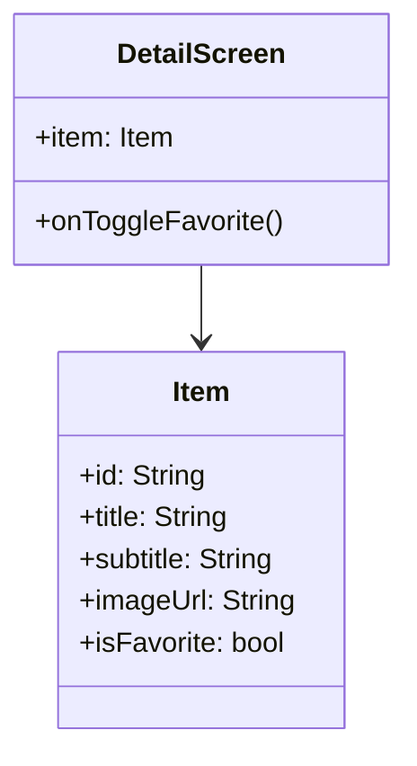
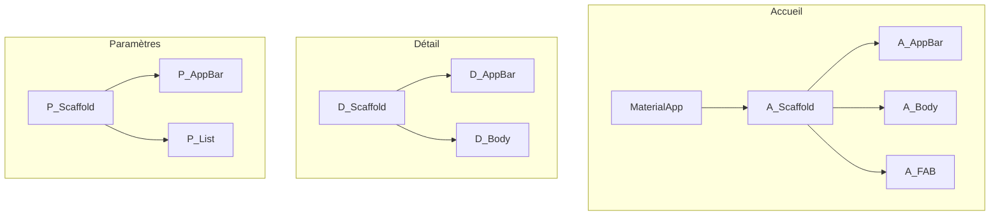
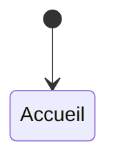

Parfait. Voici un **énoncé d’exercice “interfaces sans code”** où les étudiant·e·s ne livrent **que des diagrammes Mermaid** (pas de Dart, pas de Flutter code). Tu peux le coller tel quel dans Thinkific/Moodle.

# Exercice — Concevoir des interfaces Flutter (sans code) avec Mermaid

## Objectif

Modéliser l’**arborescence des widgets**, la **navigation** et les **états d’UI** d’une mini-app Flutter **uniquement avec des diagrammes Mermaid**.

## Consignes

* **Aucun code Flutter**.
* Livrer **3 diagrammes Mermaid** minimum :

  1. **Widget Tree** (structure visuelle de chaque écran)
  2. **Navigation** (flux entre écrans)
  3. **États d’UI** (composants interactifs et réactions simples)
* 3 écrans exigés : **Accueil**, **Détail**, **Paramètres**.
* Respecter les **noms de composants de haut niveau** (MaterialApp, Scaffold, AppBar, Body).

## Barème (40 pts)

* Widget Tree clair et complet (3 écrans) — 16 pts
* Navigation (états initiaux, transitions, retours) — 12 pts
* États d’UI (interactions et retours visuels) — 8 pts
* Lisibilité (légendes, regroupements, cohérence) — 4 pts

---

## 1) Widget Tree par écran (Mermaid – flowchart)

> Représente la hiérarchie **du plus haut au plus bas**. Un sous-graph = un écran.

```mermaid
flowchart TD
  subgraph Ecran_Accueil[Écran Accueil]
    MaterialApp --> A_Scaffold[Scaffold]
    A_Scaffold --> A_AppBar[AppBar: titre "Accueil"]
    A_Scaffold --> A_Body[Body: SingleChildScrollView]
    A_Body --> A_Col[Column]
    A_Col --> A_Titre[Text: "Bienvenue"]
    A_Col --> A_Bandeau[Container (info)]
    A_Col --> A_Grille[Row/Wrap de cartes]
    A_Scaffold --> A_FAB[FAB: add_alert]
  end

  subgraph Ecran_Detail[Écran Détail]
    Detail_Scaffold[Scaffold]
    Detail_Scaffold --> D_AppBar[AppBar: titre dynamique]
    Detail_Scaffold --> D_Body[Body: Column]
    D_Body --> D_Hero[Image/Hero]
    D_Body --> D_Texte[Text descriptif]
    D_Body --> D_Actions[Row: Boutons]
  end

  subgraph Ecran_Parametres[Écran Paramètres]
    P_Scaffold[Scaffold]
    P_Scaffold --> P_AppBar[AppBar: "Paramètres"]
    P_Scaffold --> P_List[ListView: switches, radios]
  end
```

### À faire (étudiant·e·s)

* Remplacer les libellés génériques par **vos composants concrets** (ex. `ListTile`, `Card`, `IconButton`).
* Ajouter au moins **2 sections** dans l’écran Accueil et **1 grille** de cartes.
* Indiquer **les propriétés clés** dans le label (ex. “AppBar: centerTitle=true”).

---

## 2) Navigation (Mermaid – stateDiagram)

> Montre les **routes**, les **actions** qui déclenchent la navigation et les **retours**.



### À faire

* Ajouter une **navigation avec arguments** (ex. `Détail(id)`).
* Préciser **au moins 1 deep-link** ou **entrée externe** (ex. notification → Détail).

---

## 3) Interactions & États d’UI (Mermaid – flowchart ou state)

> Décrire **ce qui se passe quand on clique** (SnackBar, highlight, chargement, disabled…).

```mermaid
flowchart LR
  User((Tap FAB)) --> ActionFAB[Afficher SnackBar "Action exécutée"]
  User2((Tap Carte#1)) --> ShowSnack[SnackBar "Carte 1"]
  User3((Tap Carte#2)) --> NavDetail[Navigate to Détail(id)]
  ToggleTheme((Switch "Thème")) --> ApplyTheme[Recalcul couleurs UI]
```

### À faire

* Ajouter **1 interaction** qui **change l’état visuel** d’un composant (ex. bouton disabled → enabled après saisie valide).
* Spécifier **les contraintes d’accessibilité** (taille touch target, contraste).

---

## 4) Variante (optionnelle) — Modèle de données écran Détail (Mermaid – classDiagram)

> Pour clarifier les **données affichées**.



---

## Livrables

* Un document (MD/PDF) contenant **les 3 diagrammes Mermaid** (plus la variante si faite).
* Une **légende** de 5–8 lignes expliquant vos choix d’UX (ordre visuel, lisibilité, actions principales).

## Critères de qualité attendus

* **Cohérence Flutter** : `MaterialApp → Scaffold → AppBar/Body/FAB`, widgets plausibles.
* **Clarté** : titres, regroupements, flèches nommées, tailles gérables.
* **Exhaustivité** : les 3 écrans existent et sont reliés.
* **Accessibilité basique** (contraste, tailles cibles, texte suffisamment grand).

---

### Gabarits vides (à remplir par les étudiant·e·s)

**Widget Tree (copier / compléter)**



**Navigation (copier / compléter)**



**Interactions (copier / compléter)**

```mermaid
flowchart LR
  %% TODO: actions utilisateur -> réactions UI (SnackBar, navigation, disabled/enabled, loader)
```

---

Si tu veux, je peux aussi te préparer **une grille de correction** (checklist) pour corriger rapidement les diagrammes, ou te générer **une version “corrigé prof”** en Mermaid pour comparaison (sans code, toujours 100% stateless).
