# Diagrammes Mermaid - Architecture Flutter

> **Thème:** Couleurs claires et professionnelles, sans emojis, optimisé pour une lecture confortable

## Palette de Couleurs Utilisée

```
Primary Blue:    #E3F2FD (très clair)    #90CAF9 (clair)    #42A5F5 (moyen)    #1976D2 (foncé)
Green:           #E8F5E9 (très clair)    #A5D6A7 (clair)    #66BB6A (moyen)
Red/Orange:      #FFEBEE (très clair)    #FFCDD2 (clair)    #E57373 (moyen)
Purple:          #F3E5F5 (très clair)    #CE93D8 (clair)    #AB47BC (moyen)
Grey:            #FAFAFA (très clair)    #E0E0E0 (clair)    #9E9E9E (moyen)
```

---

## 1. Vue d'ensemble de l'Application

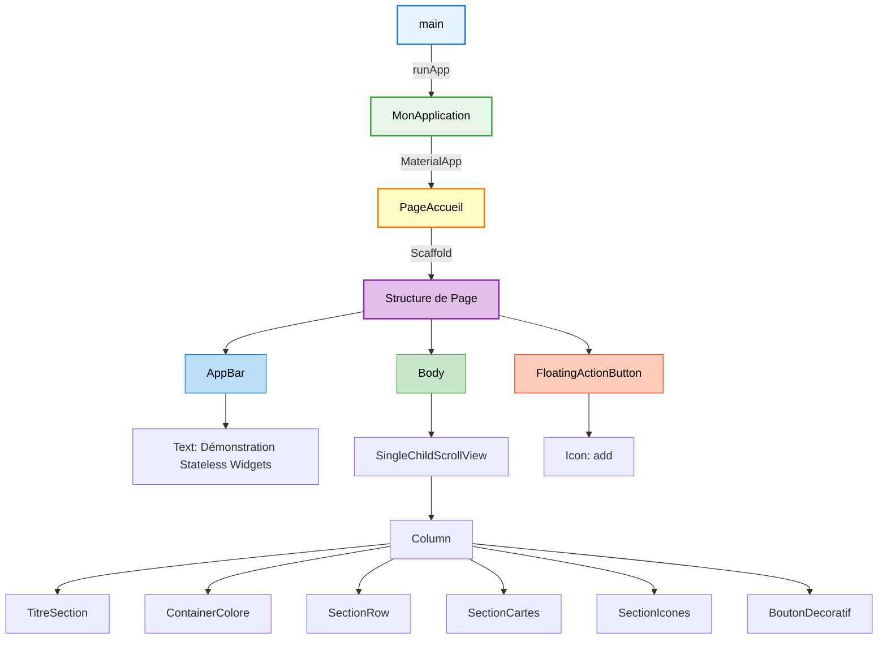

## 2. Hiérarchie Complète des Widgets

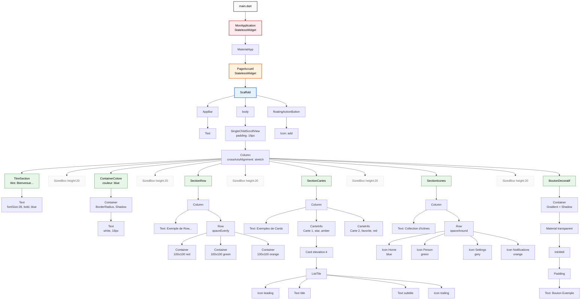

## 3. Disposition Layout - Column (Vertical)

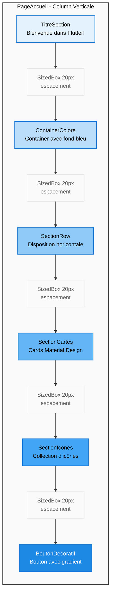

## 4. SectionRow - Disposition Horizontale

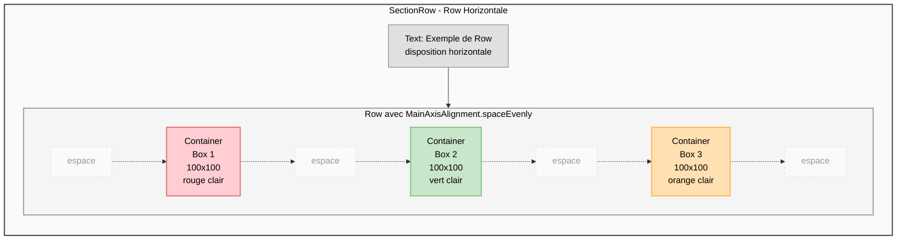

## 5. SectionCartes - Structure des Cards

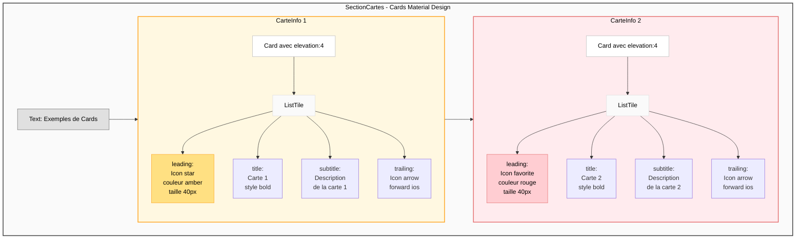

## 6. SectionIcones - Disposition des Icônes

```mermaid
graph TB
    subgraph SectionIconesWidget["SectionIcones - Row avec spaceAround"]
        direction TB
        
        LabelIcones[Text: Collection d'icônes]
        
        subgraph RowIcones["Row - 4 icônes avec labels"]
            direction LR
            
            S1[espace]
            
            subgraph Icon1Col["Column 1"]
                I1[Icon home<br/>couleur bleu<br/>taille 40px]
                T1[Text: Home<br/>taille 12px]
                I1 --> T1
            end
            
            S2[espace]
            
            subgraph Icon2Col["Column 2"]
                I2[Icon person<br/>couleur vert<br/>taille 40px]
                T2[Text: Profil<br/>taille 12px]
                I2 --> T2
            end
            
            S3[espace]
            
            subgraph Icon3Col["Column 3"]
                I3[Icon settings<br/>couleur gris<br/>taille 40px]
                T3[Text: Paramètres<br/>taille 12px]
                I3 --> T3
            end
            
            S4[espace]
            
            subgraph Icon4Col["Column 4"]
                I4[Icon notifications<br/>couleur orange<br/>taille 40px]
                T4[Text: Alertes<br/>taille 12px]
                I4 --> T4
            end
            
            S5[espace]
            
            S1 -.-> Icon1Col
            Icon1Col -.-> S2
            S2 -.-> Icon2Col
            Icon2Col -.-> S3
            S3 -.-> Icon3Col
            Icon3Col -.-> S4
            S4 -.-> Icon4Col
            Icon4Col -.-> S5
        end
        
        LabelIcones --> RowIcones
    end
    
    style SectionIconesWidget fill:#FAFAFA,stroke:#424242,stroke-width:2px,color:#000
    style LabelIcones fill:#E0E0E0,stroke:#757575,stroke-width:1px,color:#000
    style RowIcones fill:#F5F5F5,stroke:#9E9E9E,stroke-width:2px,color:#000
    style Icon1Col fill:#E3F2FD,stroke:#42A5F5,stroke-width:2px,color:#000
    style Icon2Col fill:#E8F5E9,stroke:#66BB6A,stroke-width:2px,color:#000
    style Icon3Col fill:#EEEEEE,stroke:#78909C,stroke-width:2px,color:#000
    style Icon4Col fill:#FFF3E0,stroke:#FFB74D,stroke-width:2px,color:#000
    style S1 fill:#FAFAFA,stroke:#E0E0E0,stroke-width:1px,stroke-dasharray: 5 5,color:#999
    style S2 fill:#FAFAFA,stroke:#E0E0E0,stroke-width:1px,stroke-dasharray: 5 5,color:#999
    style S3 fill:#FAFAFA,stroke:#E0E0E0,stroke-width:1px,stroke-dasharray: 5 5,color:#999
    style S4 fill:#FAFAFA,stroke:#E0E0E0,stroke-width:1px,stroke-dasharray: 5 5,color:#999
    style S5 fill:#FAFAFA,stroke:#E0E0E0,stroke-width:1px,stroke-dasharray: 5 5,color:#999
```

## 7. BoutonDecoratif - Architecture en Couches

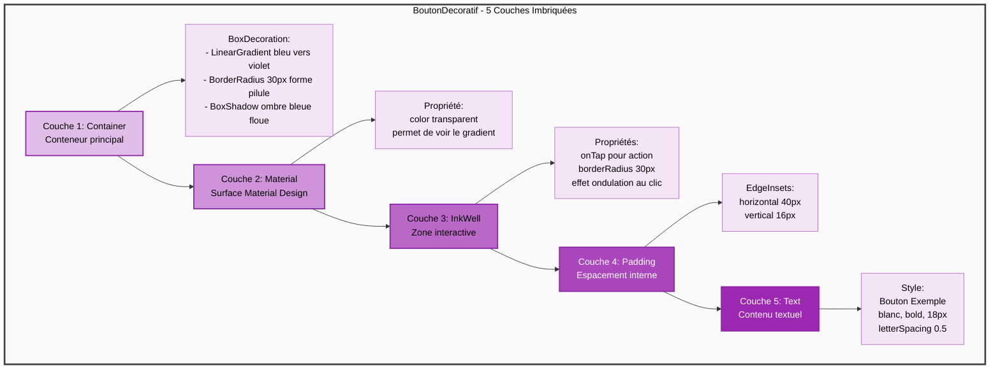

## 8. Flux de Construction des Widgets

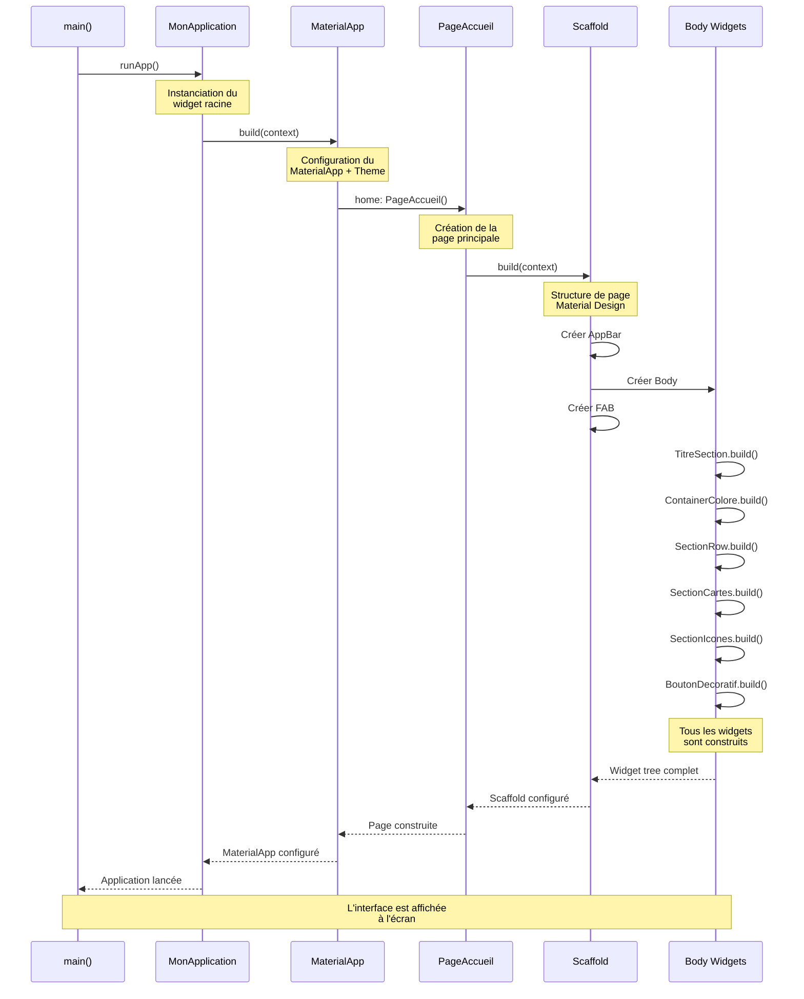

## 9. Types de Widgets Utilisés

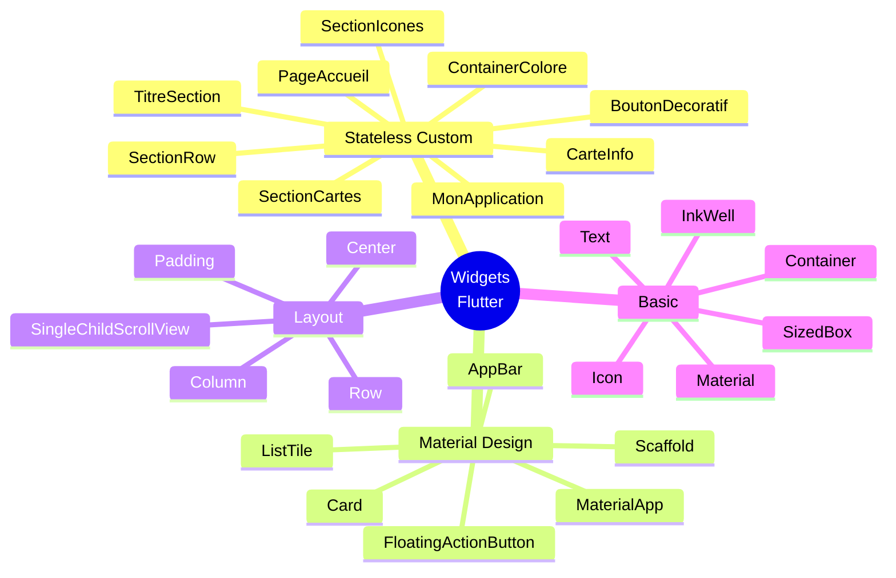

## 10. Paramètres et Props Flow

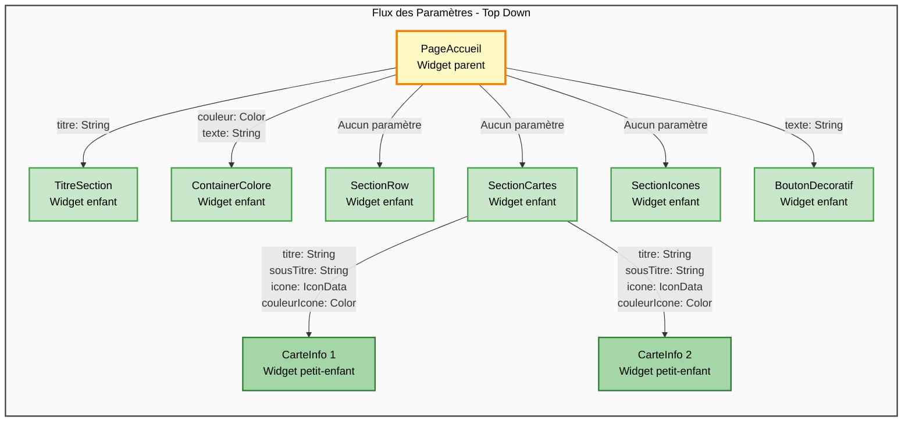

## 11. Cycle de Vie des Stateless Widgets

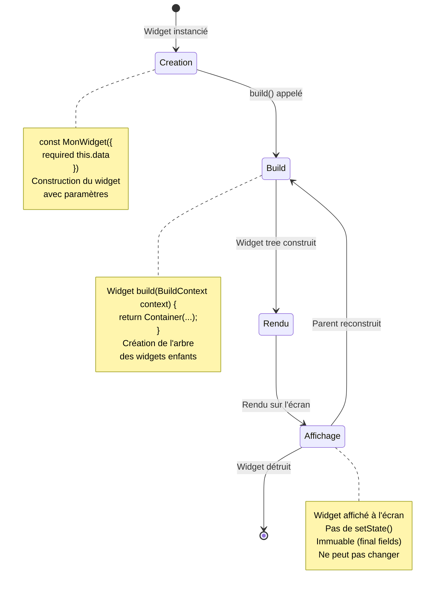

## 12. Architecture Visuelle de l'Écran

```mermaid
graph TB
    subgraph Screen["Ecran de l'Application Flutter"]
        subgraph AppBarZone["AppBar - Barre superieure"]
            AppBarContent[Demonstration Stateless Widgets<br/>Titre centre, fond bleu, texte blanc]
        end
        
        subgraph ScrollZone["Zone Defilante - SingleChildScrollView"]
            Zone1[TitreSection<br/>Bienvenue dans Flutter!<br/>Titre 28px, bleu fonce, centre]
            
            Zone2[ContainerColore<br/>Container avec fond colore<br/>BorderRadius 15px, BoxShadow<br/>Texte blanc 18px centre]
            
            Zone3[SectionRow<br/>Exemple de Row disposition horizontale<br/>3 Containers 100x100: rouge, vert, orange<br/>Alignement spaceEvenly]
            
            Zone4[SectionCartes<br/>Exemples de Cards Material Design<br/>Card 1: Icon star amber + texte<br/>Card 2: Icon favorite rouge + texte<br/>ListTile avec leading, title, subtitle, trailing]
            
            Zone5[SectionIcones<br/>Collection d'icones avec labels<br/>Row spaceAround avec 4 Columns<br/>Icons: home, person, settings, notifications<br/>Taille 40px avec labels 12px]
            
            Zone6[BoutonDecoratif<br/>Bouton avec gradient bleu vers violet<br/>BorderRadius 30px forme pilule<br/>BoxShadow + InkWell effet tactile<br/>Texte blanc bold 18px centre]
        end
        
        subgraph FABZone["FloatingActionButton"]
            FABContent[Bouton flottant<br/>Icon add +<br/>Fond bleu, icone blanche]
        end
        
        AppBarZone --> Zone1
        Zone1 --> Zone2
        Zone2 --> Zone3
        Zone3 --> Zone4
        Zone4 --> Zone5
        Zone5 --> Zone6
        Zone6 -.-> FABZone
    end
    
    style Screen fill:#F5F5F5,stroke:#424242,stroke-width:3px,color:#000
    style AppBarZone fill:#1976D2,stroke:#0D47A1,stroke-width:2px,color:#fff
    style AppBarContent fill:#1565C0,stroke:#0D47A1,stroke-width:1px,color:#fff
    style ScrollZone fill:#FAFAFA,stroke:#9E9E9E,stroke-width:2px,color:#000
    style Zone1 fill:#E3F2FD,stroke:#1976D2,stroke-width:1px,color:#000
    style Zone2 fill:#BBDEFB,stroke:#1976D2,stroke-width:1px,color:#000
    style Zone3 fill:#90CAF9,stroke:#1976D2,stroke-width:1px,color:#000
    style Zone4 fill:#64B5F6,stroke:#1976D2,stroke-width:1px,color:#000
    style Zone5 fill:#42A5F5,stroke:#1976D2,stroke-width:1px,color:#000
    style Zone6 fill:#1E88E5,stroke:#1976D2,stroke-width:1px,color:#fff
    style FABZone fill:#FF6F00,stroke:#E65100,stroke-width:2px,color:#fff
    style FABContent fill:#FB8C00,stroke:#E65100,stroke-width:1px,color:#fff
```

## 13. Comparaison Row vs Column

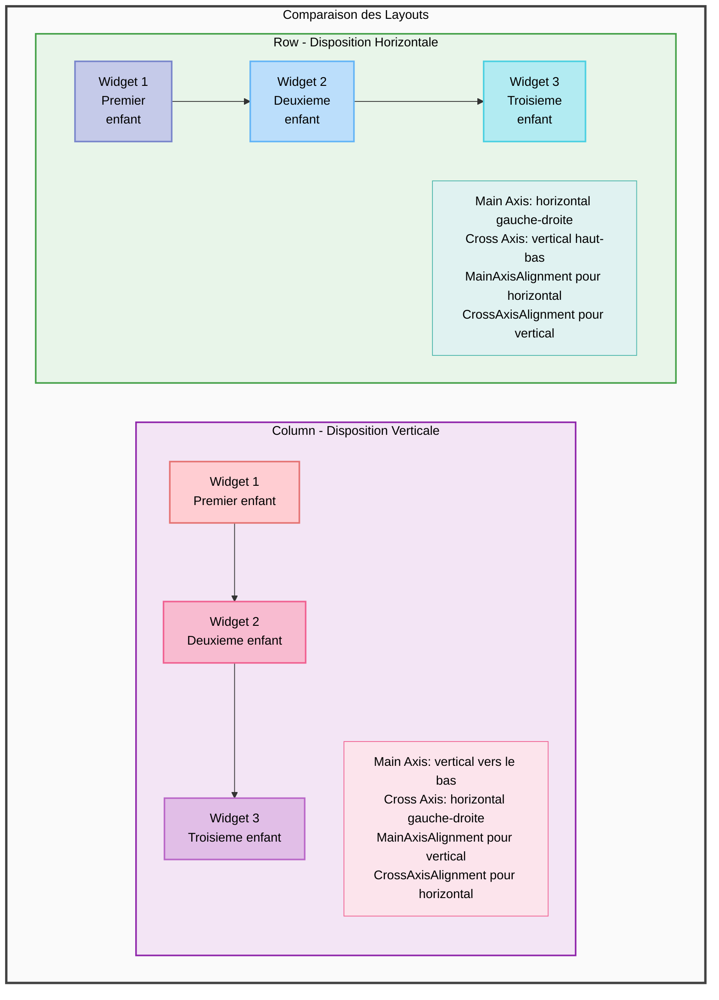

---

## Legende

| Terme | Signification |
|-------|--------------|
| **Widget** | Composant de l'interface Flutter |
| **Stateless** | Widget immuable sans état interne |
| **Container** | Boîte avec décoration et contraintes |
| **Column** | Disposition verticale des enfants |
| **Row** | Disposition horizontale des enfants |
| **Card** | Surface Material Design avec élévation |
| **Scaffold** | Structure de base d'une page Material |
| **AppBar** | Barre d'application en haut de l'écran |
| **FAB** | FloatingActionButton - Bouton flottant |
| **Main Axis** | Axe principal de la disposition |
| **Cross Axis** | Axe perpendiculaire à l'axe principal |
| **Elevation** | Hauteur visuelle d'une surface (ombre) |
| **Theme** | Configuration globale du style visuel |

---

## Convention de Couleurs dans les Diagrammes

- **Bleu clair** (#E3F2FD - #42A5F5) : Widgets principaux, structure
- **Vert clair** (#E8F5E9 - #66BB6A) : Widgets personnalisés
- **Orange/Jaune** (#FFF3E0 - #FFB74D) : Points d'entrée, actions
- **Violet clair** (#F3E5F5 - #AB47BC) : Couches, architecture
- **Gris clair** (#FAFAFA - #9E9E9E) : Espacement, métadonnées
- **Rouge clair** (#FFEBEE - #E57373) : Accents, avertissements

---

## Utilisation des Diagrammes

### Pour les Étudiants

1. **Commencer par le diagramme 1** pour voir la vue d'ensemble
2. **Consulter le diagramme 2** pour la hiérarchie complète
3. **Étudier les diagrammes 3, 4, 13** pour comprendre les layouts
4. **Analyser les diagrammes 5, 6, 7** pour les widgets spécifiques
5. **Examiner les diagrammes 8, 10, 11** pour le flux de données

### Visualisation

Ces diagrammes Mermaid peuvent être visualisés dans :

- **GitHub** : Rendu automatique des diagrammes Mermaid
- **VS Code** : Extension "Markdown Preview Mermaid Support"
- **En ligne** : [mermaid.live](https://mermaid.live) ou [mermaid-js.github.io](https://mermaid-js.github.io/mermaid-live-editor)
- **Documentation** : GitBook, MkDocs, Docusaurus (support natif)

### Export

Pour exporter en image :
1. Copier le code Mermaid
2. Ouvrir [mermaid.live](https://mermaid.live)
3. Coller le code
4. Cliquer sur "Export" (PNG, SVG, PDF)

---

## Notes Pédagogiques

### Points Clés à Retenir

1. **Composition** : Flutter utilise la composition de widgets simples pour créer des interfaces complexes
2. **Immutabilité** : Les Stateless Widgets sont immuables (const, final)
3. **Hiérarchie** : L'arbre des widgets définit la structure de l'interface
4. **Props Flow** : Les données descendent du parent vers les enfants
5. **Build Method** : Chaque widget définit son rendu via build()

### Exercices Suggérés

1. Identifier le widget racine dans le diagramme 1
2. Tracer le chemin de main() jusqu'à un widget Text
3. Compter le nombre de niveaux dans la hiérarchie
4. Expliquer la différence entre Row et Column
5. Dessiner un nouveau widget personnalisé et son intégration
